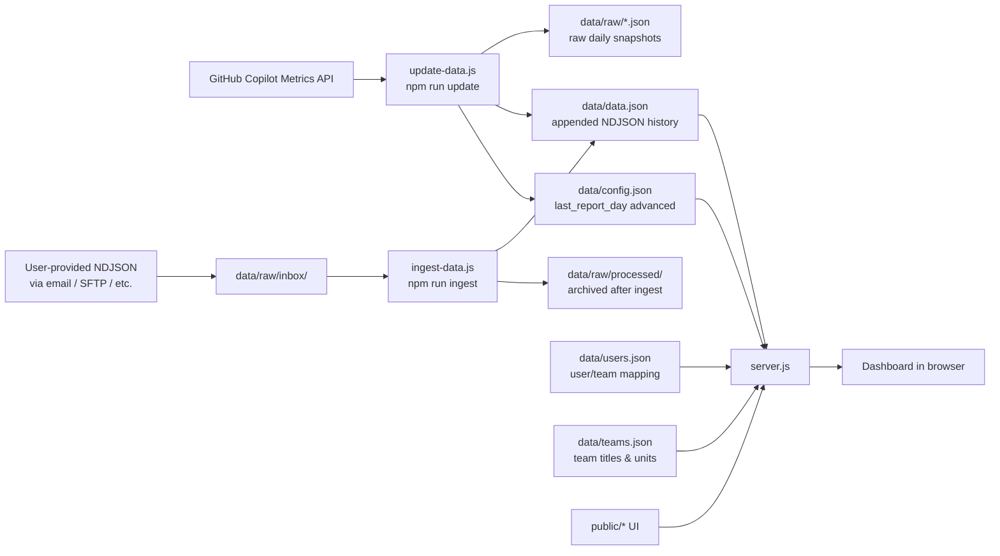

# Yet Another (but cool) Github Copilot Metrics Dashboard

Lightweight GitHub Copilot usage dashboard for teams. It reads raw metrics exposed via new [Github REST API endpoints for Copilot usage metrics](https://docs.github.com/en/enterprise-cloud@latest/rest/copilot/copilot-usage-metrics?apiVersion=2022-11-28), aggregates them per user, and serves a browser-based leaderboard-style dashboard with filters and trend hints.

# Metrics captured

[Detailed documentation on every metrics](/docs/metrics.md)

The dashboard tracks activity across two Copilot interfaces:

- **IDE plugin** — chat asks, code completions, agent/coding-agent runs; favorite IDE with version, language, model
- **CLI** — GitHub Copilot CLI prompt counts, active days via CLI, and last known CLI version (shown in user detail popup)


> ⚠️ **Disclaimer:** this is a fully **vibe-coded** project that did **not** go through comprehensive code review or testing. Results may be inaccurate, and bugs are possible.

## Why this project exists

- [Github Copilot built-in dashboards are still in Public Preview](https://github.blog/changelog/2026-02-20-organization-level-copilot-usage-metrics-dashboard-available-in-public-preview/), they are yet rudimentary and require special access rights difficult to obtain in large enterprises.
- Existing external dashboards ([by Github](https://github.com/github-copilot-resources/copilot-metrics-viewer), [by Microsoft](https://github.com/microsoft/copilot-metrics-dashboard)) were not promptly updated for new REST API compartibility and likely stop working on April 2, 2026 when [Github sunsets its legacy Github Metrics API](https://docs.github.com/en/rest/copilot/copilot-metrics?apiVersion=2026-03-10). 

## Target audience
Dashbord aims at AI/Agile Coaches, Teams leaders, Engineering managers, Project- and Delivery managers, Procurement associates and helps themto quickly answer questions like:

- Who is actively using Copilot and who is not?
- Which models/IDEs/languages are most used?
- How usage differs across teams and time?

## Mocked data included

This repository is provided with **mocked data** stored under `mock\*.json`for demonstration and development.

## Tech stack

- **Runtime:** Node.js (CommonJS)
- **Backend:** built-in `http`, `fs`, `https` modules (no framework)
- **Frontend:** vanilla HTML/CSS/JavaScript
- **Data source:** GitHub REST API
- **Storage:** local JSON/NDJSON files (`data/*.json`)

Project was intentionally built simple and file-based, so you can run it locally without infrastructure or implement your own data persistancy layer. 

## Repository structure

- `server.js` — starts the web server and serves API + static UI
- `update-data.js` — fetches new Copilot metrics, stores the, under `data/raw/*.json` and appends them to `data/data.json`
- `ingest-data.js` — imports user-provided NDJSON files from `data/raw/inbox/` into `data/data.json` without calling the GitHub API
- `debug.js` — downloads hisotrical data to `data/debug/*.json`and compares it with local `data/data.json`
- `data/config.json` — stores enterprises and organizations with their slugs, token variable names, and last-sync state
- `data/users.json` — UserId mapping to Display name, Team, Role, Revoked status (all optional)
- `data/teams.json` — team ID mapping to display title, business unit, and manager name
- `data/data.json` — all your data used to build a dashboard
- `data/raw/inbox/` — drop your own NDJSON files here for ingest
- `data/raw/processed/` — files are moved here automatically after successful ingest
- `public/` — dashboard UI assets
- `docs/` – documentation and screnshots

## Quick start

### 1) Prerequisites

- Node.js 18+

### 2) Install dependencies

```bash
npm install
```

### 3) Prepare environment

Copy `.env.example` to `.env`:

```bash
cp .env.example .env
```

By default, `.env.example` contains `USE_MOCK_DATA=true`, so the app loads `config/data/users` from `mock/*.json` for local demo/development.

### 3) Start the dashboard

```bash
npm run dev
```

Open `http://localhost:3000` - you should see mocked data loaded.

## Using with real data

### 1) Prerequisites

- You created one or more [GitHub personal access tokens (classic)](https://docs.github.com/en/authentication/keeping-your-account-and-data-secure/managing-your-personal-access-tokens) with the appropriate scopes:
  - Enterprise-level metrics: `read:enterprise` or `manage_billing:copilot`
  - Organization-level metrics: `read:org` or `manage_billing:copilot`
- [Copilot usage metrics](https://docs.github.com/en/enterprise-cloud@latest/copilot/how-tos/administer-copilot/manage-for-enterprise/manage-enterprise-policies#defining-policies-for-your-enterprise) policy must be enabled.

### 3) Configure environment and project

1. Add your token variable(s) to `.env` (use `.env.example` as a template). Each token variable name is referenced from `config.json` via the `env_token` field, for example:
   ```
   GITHUB_ENTERPRISE_TOKEN=ghp_...
   GITHUB_ORG_TOKEN=ghp_...
   ```
2. Set `USE_MOCK_DATA=false` in `.env` before productive use, so data is loaded from `/data` instead of `/mock`.
3. Copy `mock/config.json` to `data/config.json`
4. Edit `data/config.json`. Each enterprise and organization entry that should be synced via the API must have:
   - `slug` — the GitHub enterprise or organization slug used in API URLs
   - `label` — optional display name used in UI/logs; when omitted, `slug` is used as fallback
   - `env_token` — name of the `.env` variable holding the access token for that scope
   - `last_report_day` — set to `""` on first run; updated automatically after each sync
   - `missing_data_days` — leave as `[]`; managed automatically

   Entries **without** an `env_token` field are skipped during API sync (useful for display-only entries).

   Enterprise and organization metrics are fetched independently — enterprise-level data is pulled first, then each org under it.

5. (optionally) Edit `data/users.json` to map GH usernames/accounts to display names, teams, roles, revoked status, and optional emails.

    Current schema is an **array**:
    ```json
    [
       {
          "accounts": ["github-login", "secondary-login"],
          "name": "Display Name",
          "team": "Team Name",
          "role": "Senior Developer",
          "revoked": false,
          "emails": ["user@company.com"]
       }
    ]
    ```

    Notes:
    - `accounts` should contain all known logins for the same person (first entry is canonical in UI grouping).
    - `emails` is optional; values are displayed and can be used for account cleanup workflows.
    - Account logins should be lowercase for reliable matching.

6. (optionally) Edit `data/teams.json` to provide human-readable titles, business units, and manager names for each team referenced in `users.json`.

    Current schema is an **array**:
    ```json
    [
       {
          "id": "my_team_id",
          "title": "My Team",
          "unit": "Business Unit",
          "manager": "Jane Smith"
       }
    ]
    ```

    Notes:
    - `id` must match the `team` field value used in `users.json`.
    - `title` is shown in the team filter dropdown, table rows, and user detail popup.
    - `unit` is used to group teams in the dropdown (optgroups) and displayed alongside the title.
    - `manager` is stored but not currently rendered in the UI (reserved for future use).
    - Teams missing from `teams.json` fall back to displaying their raw ID.

### 4) Pull/update metrics data

```bash
npm run update
```

This runs `update-data.js`, which for each configured enterprise and organization (those with an `env_token`):

- fetches the latest 28-day report from the enterprise endpoint, then from each org endpoint,
- backfills any calendar gaps via per-day API calls,
- saves raw NDJSON files to `data/raw/`,
- appends new records to `data/data.json` (deduplicates by `user_id:day`),
- updates `last_report_day` and `missing_data_days` in `data/config.json` for each scope.

## Data flow and freshness



This integration is **not real-time**. GitHub Copilot metrics are published as daily NDJSON-style reports, and new files typically appear in the API **earliest on the next business day**. In practice, reporting delays of **24 hours or more** are normal.

### 3) Start the dashboard

```bash
npm start
```

Opens `http://localhost:3000` - you should see real data loaded.


## Importing data without GitHub API access

In many enterprise environments developers do not have direct access to the GitHub API — metrics files are instead delivered by a central team via email, SFTP, shared drive, or a similar intermediary channel. The `npm run ingest` command covers this use-case.

Files must be in the same NDJSON format produced by the GitHub Copilot Metrics API (one JSON object per line, each with at least `user_id` and `day` fields).

### Folder structure

Create the inbox folder before first use (the script also creates it automatically on first run):

```bash
mkdir -p data/raw/inbox
mkdir -p data/raw/processed
```

### Workflow

1. Place one or more NDJSON files into `data/raw/inbox/`.
2. Run the ingest command:

```bash
npm run ingest
```

The script will:
- Parse every `*.json` file found in `data/raw/inbox/`
- Skip any record whose `user_id:day` key already exists in `data.json` (no duplicates)
- Append genuinely new records to `data/data.json`
- Move each processed file to `data/raw/processed/` so it is not ingested again

3. Start (or restart) the dashboard:

```bash
npm start
```

Or as a single command sequence:

```bash
npm run ingest && npm start
```

You can drop multiple files at once — all are processed in a single run. If a filename collision occurs in `processed/`, a counter suffix is added automatically.

## NPM tasks

- `npm start` — run the dashboard server (`node server.js`)
- `npm run dev` — same as start (no watcher currently)
- `npm run update` — fetch and append new Copilot metrics from the GitHub API
- `npm run ingest` — import user-provided NDJSON files from `data/raw/inbox/` into `data/data.json`

## Troubleshooting

`debug.js` is an all-in-one debug and analysis utility. Run it without arguments to see all available commands.

**User-level verification** — re-downloads raw data from the API and compares it against `data.json`:

- `node debug.js YYYY-MM-DD` — re-download one day and compare
- `node debug.js latest` — re-download last 28 days and compare

**Org-level metrics** — fetches and analyses org-wide aggregated data (active-user counts, breakdowns by IDE/feature/model):

- `node debug.js org fetch` — download latest 28-day org metrics
- `node debug.js org discover` — compare key vocabulary (IDEs, models, features) vs `data.json`
- `node debug.js org compare YYYY-MM-DD` — check day totals discrepancy: user aggregate vs org

All downloads are saved to `data/debug/`.


## Known issues and limitations

- No database (file-based storage only)
- No auth/access control (deploy locally or in secure environment)
- Update process is **not automatic**:
	- You must run `npm run update` manually, or
	- schedule it externally (cron, CI job, task scheduler)
- Limited validation and error handling
- No tests
- Metrics interpretation is generic and may not match your KPIs

## Contributing

Contributions are welcomed to address the issues and bring more features.

## License

Licensed under the **MIT License**.
